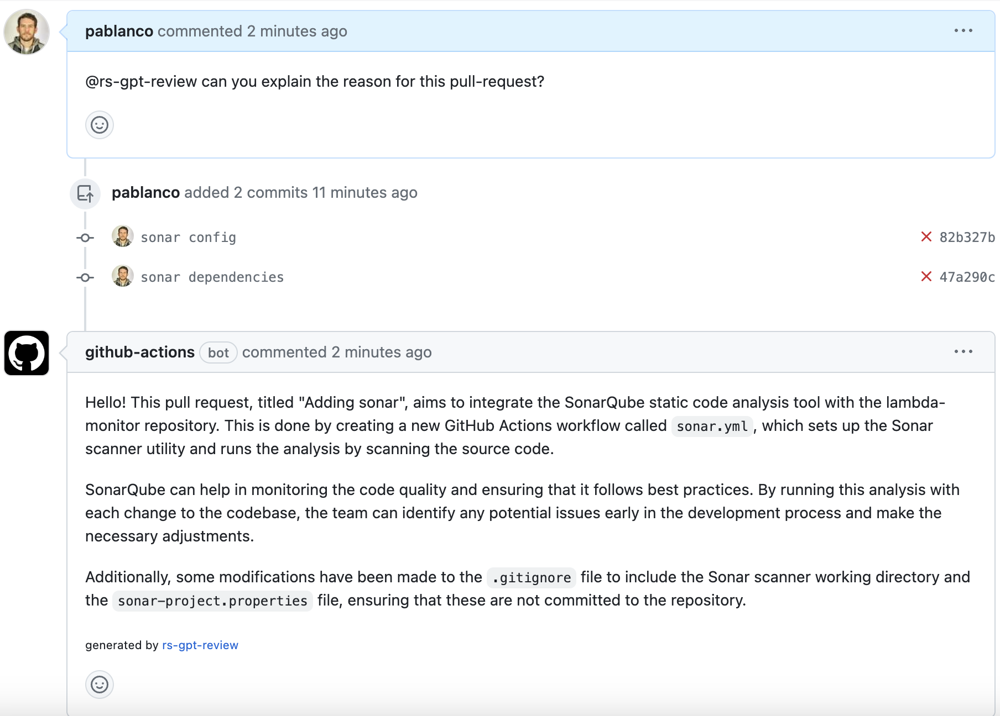

:warning: Don't install this bot in **public** repositories because it allows anyone to make calls to OpenAI (via Issue/PR comments), which can potentially be abused by malicious users.

# rs-gpt-review GitHub Action

rs-gpt-review is an AI-powered GitHub Action that generates helpful responses to comments on issues and pull requests. It's like having a conversation with `GPT-4`, but without actually leaving GitHub and available to everyone in Rootstrap.

## Getting Started

To use rs-gpt-review, you'll need to create an OpenAI API key and add rs-gpt-review to your workflow. Here are the steps to get started:

1. Create an [OpenAI API key](https://platform.openai.com/account/api-keys) if you don't already have one. Keep in mind that you'll occur charges for using the API.
2. Save your OpenAI API key as a [Secret](https://docs.github.com/en/actions/security-guides/encrypted-secrets#creating-encrypted-secrets-for-a-repository) in your repository.
3. Create a new workflow in folder `.github/workflows` that will be triggered on [issues](https://docs.github.com/en/actions/using-workflows/events-that-trigger-workflows#issues), [pull requests](https://docs.github.com/en/actions/using-workflows/events-that-trigger-workflows#pull_request) and [comments](https://docs.github.com/en/actions/using-workflows/events-that-trigger-workflows#issue_comment).

### Workflow

```yaml
# File: .github/workflows/rs-gpt-review.yml
name: 'rs-gpt-review'

# Run the workflow on new issues, pull requests and comments
on:
  issues:
    types: [opened]
  pull_request:
    types: [opened]
  issue_comment:
    types: [created]
  pull_request_review_comment:
    types: [created]

# Allows the workflow to create comments on issues and pull requests
permissions:
  issues: write
  pull-requests: write
  contents: write

jobs:
  # Runs for issues, pull requests and comments
  rs-gpt-review:
    name: rs-gpt-review comment
    # Only run the job if the comment contains @rs-gpt-review
    if: ${{ github.event_name == 'issues' && contains(github.event.issue.body, '@rs-gpt-review') || github.event_name == 'pull_request' && contains(github.event.pull_request.body, '@rs-gpt-review') || github.event_name == 'issue_comment' && contains(github.event.comment.body, '@rs-gpt-review') || github.event_name == 'pull_request_review_comment' && contains(github.event.comment.body, '@rs-gpt-review') }}
    runs-on: ubuntu-latest
    steps:
      - uses: actions/checkout@v3
      # The action will only run if the description or comments mentions @rs-gpt-review
      - uses: rootstrap/rs-gpt-review@v2
        name: rs-gpt-review
        with:
          github_token: ${{ secrets.GITHUB_TOKEN }}
          openai_key: ${{ secrets.OPENAI_KEY }}
```

The action will only run if the issue, pull requests or comments mentions `@rs-gpt-review`. Otherwise, the action will return immediately without doing anything. If you want to skip the whole workflow run, you can use the [`if` conditional](https://docs.github.com/en/actions/learn-github-actions/workflow-syntax-for-github-actions#jobsjob_idif) to check if the issue, pull request or comment mentions `@rs-gpt-review`.

```yml
jobs:
  # Runs only for issues
  issue:
    name: Issue opened
    # Check if the issue contains @rs-gpt-review, otherwise skip the workflow run
    if: ${{ github.event_name == 'issues' && contains(github.event.issue.body, '@rs-gpt-review') }}
    runs-on: ubuntu-latest
    steps:
      - uses: actions/checkout@v3
      - uses: rootstrap/rs-gpt-review@v2
        name: rs-gpt-review
        with:
          github_token: ${{ secrets.GITHUB_TOKEN }}
          openai_key: ${{ secrets.OPENAI_KEY }}
```

Check out [`main.yml`](./.github/workflows/main.yml) for more examples.

### Permissions

The `GITHUB_TOKEN` requires the following permissions to create comments on issues and pull requests:

- `issues: write`
- `pull-requests: write`
- `contents: write`

Add these permissions to your workflow or individual jobs using the [`permissions`](https://docs.github.com/en/actions/security-guides/automatic-token-authentication#using-the-github_token-in-a-workflow) keyword.

### Secrets

Sensitive information, such as the OpenAI API key, should be stored as [encrypted secrets](https://docs.github.com/en/actions/security-guides/encrypted-secrets#creating-encrypted-secrets-for-a-repository) in the repository.

Add your OpenAI API key as a secret to your repository and reference it using the `${{ secrets.OPENAI_KEY }}` syntax.

## Action Inputs

| Name                 | Required | Default | Description                                                                                                                                                                                                                                                                                                               |
| -------------------- | -------- | ------- | ------------------------------------------------------------------------------------------------------------------------------------------------------------------------------------------------------------------------------------------------------------------------------------------------------------------------- |
| `github_token`       | Yes      |         | The access token used to retrieve and create comments on the issues and pull requests. This will typically be your GitHub token. If so, use `${{ secrets.GITHUB_TOKEN }}`                                                                                                                                                 |
| `openai_key`         | Yes      |         | The API key used for OpenAI chat completion request. Go to [OpenAI](https://platform.openai.com/account/api-keys) to create a new API key                                                                                                                                                                                 |
| `openai_temperature` | No       | 0.8     | What sampling temperature to use, between 0 and 2. Higher values like 0.8 will make the output more random, while lower values like 0.2 will make it more focused and deterministic. See [API reference](https://platform.openai.com/docs/api-reference/chat/create#completions/create-temperature) for more information. |     |     |     |     |     |     
| `model` | No       | gpt-4     | Default model to use. See [available models](https://platform.openai.com/docs/models) for more information. |     |     |     |     |     |     
| `files_excluded` | No       | empty     | Comma-separated file names to be excluded from diff, (e.g. file1,file2,file3). |     |     |     |     |     |     
| `openai_top_p`       | No       | 0       | An alternative to sampling with temperature, called nucleus sampling, where the model considers the results of the tokens with top_p probability mass. See [API reference](https://platform.openai.com/docs/api-reference/chat/create#completions/create-top_p) for more information.                                     |
| `openai_max_tokens`  | No       | 4096    | The maximum number of tokens to generate in the completion. See [API reference](https://platform.openai.com/docs/api-reference/chat/create#completions/create-max_tokens) for more information.                                                                                                                           |

# Examples

### [Explain Pull Requests](https://github.com/rootstrap/lambda-monitor/pull/7)


# Contributing

We welcome bug reports, feature requests, and contributions to rs-gpt-review! If you'd like to contribute, please open an issue or pull request on this repository.


# Action development and maintenance

To test the action locally we can use `act`. This tool depends on `docker` to run workflows. For details you can check [this](https://github.com/nektos/act#installation) page.

You'll also need to create a [github personal access token](https://docs.github.com/en/authentication/keeping-your-account-and-data-secure/managing-your-personal-access-tokens) and openAI key.

1. Install act

```
brew install act
```

2. Create the secrets
create a secret file to store the github action and

```
echo "GITHUB_TOKEN=<MY_GITHUB_TOKEN>
OPENAI_KEY=<MY_OPENAI_KEY>" > .secrets
```


3. Run action workflow

```
npm run pull_request
```